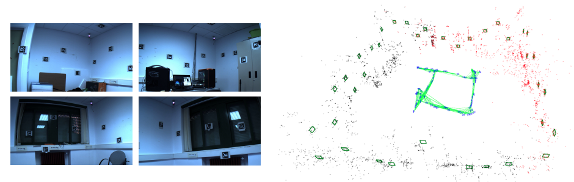
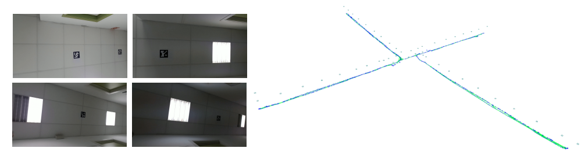

# update
2023.08.19
In fact, I don't maintain this repository anymore, but I feel that some friends may be interested in this code. And I found out that the links of UcoSLAM and SPM-SLAM below can no longer be opened, so I put the previous information and data on the Baiduwangpan, hoping that could be useful. In addition, I really forgot some details about the code, but this code does only need some dependencies based on ORB_SLAM2 to run, and then it is reasonable to realize the initial scale correction and closed-loop correction.

其实我现在已经不维护这个仓库了，但感觉有些同学可能对这个代码感兴趣。然后才发现下面UcoSLAM和SPM-SLAM的链接已经打不开了，因此我把以前的资料和数据放在了网盘上（包括最开始SPM-SLAM放在网上的数据和我自己处理的脚本、参数文件），希望对大家有所帮助。另外，关于代码的一些细节，我是真的有点忘了，但是这个代码确实只需要基于ORB_SLAM2的一些依赖即可运行，然后讲道理是可以实现初始化的尺度校正和闭环修正等操作的。

link 链接: https://pan.baidu.com/s/1m0gLQ1aM8pWfjZNbCZRzKw 提取码: jc4i 

## Run
`./mono_cvcam  path_to_vocabulary  videofile  cameraparams.yml  outposes ARUCO_DIC`

没记错的话，spm video1-8 的ARUCO_DIC是ARUCO，samsung7_markers的ARUCO_DIC是ARUCO_MIP_25h7。

---

I'm now adding some new features in this program. I will open the whole source when I finish it. Please be waiting.

# ORB_SLAM2_aruco

This SLAM system is based on [ORB_SLAM2](https://github.com/raulmur/ORB_SLAM2.git).

I added fiducial markers--Aruco to obtain the scale, decrease scale drift, and track in large-scale environment.

I learned a lot from [UcoSLAM](http://www.uco.es/investiga/grupos/ava/node/62), and wrote the codes from my personal understanding.

### Function:

1. It can initialize map by Aruco or Keypoints. If initial by Keypoints, there is a module to correct scale.(In the LocalMapping thread, I commented this code because I usually use aruco to initial map. But it still work)
2. It can track by MapPoint and MapAruco features.
3. It can update all features and keyframe in localMapping thread.
4. It can detect and correct loop by MapAruco or MapPoints, and update all features in the global bundle adjustment.
5. It can show Aruco in the map.

## Notice:

The code in `/Examples/Monocular/mono_cvcam.cc` is come from [SPM-SLAM](http://www.uco.es/investiga/grupos/ava/node/58) 

### Citation

R. Mur-Artal, J. M. M. Montiel, and J. D. Tardos, “ORB-SLAM: a Versatile and Accurate Monocular SLAM System,” IEEE Transactions on Robotics, vol. 31, no. 5, pp. 1147–1163, 2015.

Rafael Muñoz-Salinas,Manuel J. Marín-Jiménez Manuel and Rafael Medina-Carnicer , "SPM-SLAM: Simultaneous Localization and Mapping with Squared Planar Markers", September 2018 Pattern Recognition DOI: 10.1016/j.patcog.2018.09.003

Rafael Muñoz-Salinas, R. Medina-Carnicer, "UcoSLAM: Simultaneous localization and mapping by fusion of keypoints and squared planar markers," Pattern Recognition, 2020,107193

