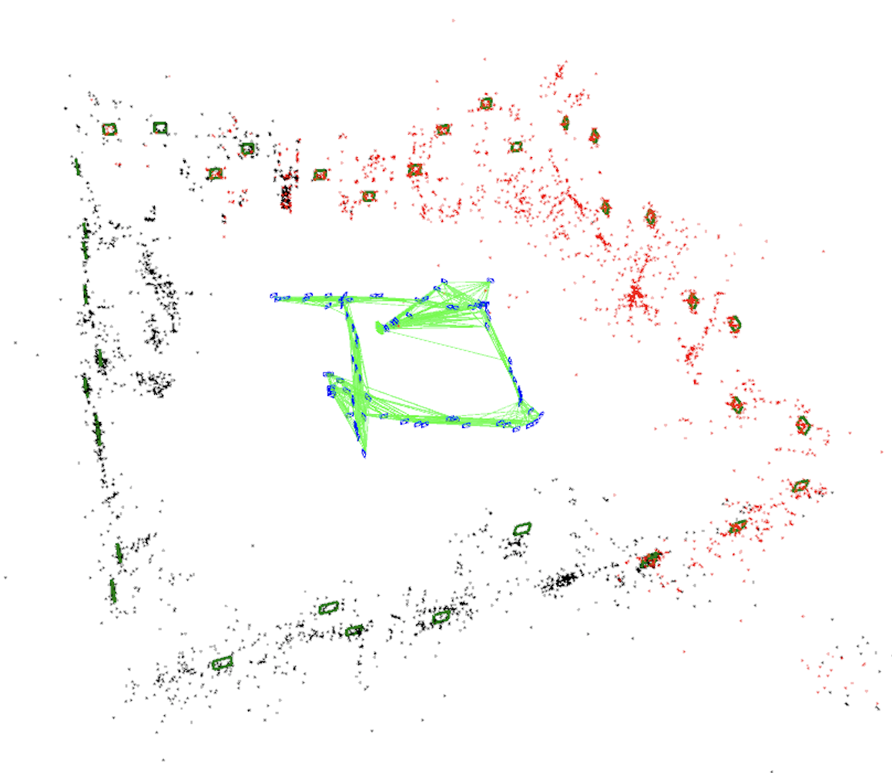
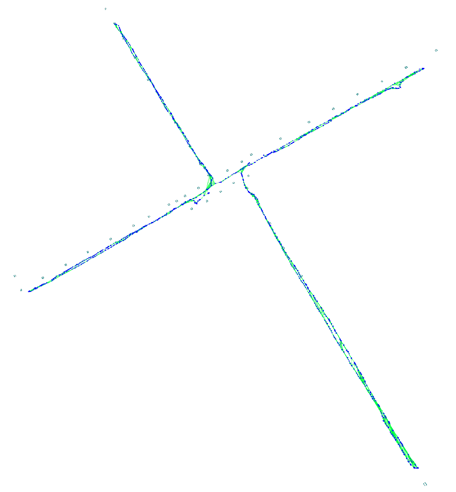

# ORB_SLAM2_aruco

This SLAM system is based on [ORB_SLAM2](https://github.com/raulmur/ORB_SLAM2.git).

I added fiducial markers--Aruco to obtain the scale, decrease scale drift, and track in large-scale environment.

I learned a lot from [UcoSLAM](http://www.uco.es/investiga/grupos/ava/node/62), and wrote the codes from my personal understanding.






### Function:

1. It can initialize map by Aruco or Keypoints. If initial by Keypoints, there is a module to correct scale.(In the LocalMapping thread, I commented this code because I usually use aruco to initial map. But it still work)
2. It can track by MapPoint and MapAruco features.
3. It can update all features and keyframe in localMapping thread.
4. It can detect and correct loop by MapAruco or MapPoints, and update all features in the global bundle adjustment.
5. It can show Aruco in the map.

### Details:

1. Using MapAruco to represent marker features( in "MapAruco.h" file).
2. Modifying and adding these in Tracking thread:
   -  MonocularInitialization(): including the way to initialize by Aruco.
   -  TrackByAruco()
   -  RelocalizationByAruco()
   -  NeedNewKeyFrame(): Adding a KeyFrame when there is a new Aruco.
   -  CreateNewKeyFrame(): Creating new MapAruco features.
3. Modifying and adding these in LocalMapping thread:
   - CreateArucoMapPoints(): to correct scale
4. Modifying and adding these in LoopClosing thread:
   - DetectLoopByAruco()
   - ComputeSim3ByAruco();
   - CorrectLoopByAruco();
5. Modifying a lot in class Optimizer, class Map, and class Initializer.
6. Modifying a little in class frame, class MapPoint, class MapDrawer, and class Keyframe.
7. Adding file "InitKeyFrame.h", "SystemSetting.h" to save the map. 
8. Adding Aruco in the Thirdparty folder.

### Run

```bash
./mono_tum path_to_vocabulary    videofile  cameraparams.yml outposes ARUCO_DIC 
```

like:

```
./Examples/Monocular/mono_cvcam Vocabulary/ORBvoc.txt /home/(user name)/data/spm-slam/video1.mp4 /home/(user name)/data/spm-slam/camera1.yml /home/(user name)/data/spm-slam/save-pose-file-name.txt ARUCO  
```

